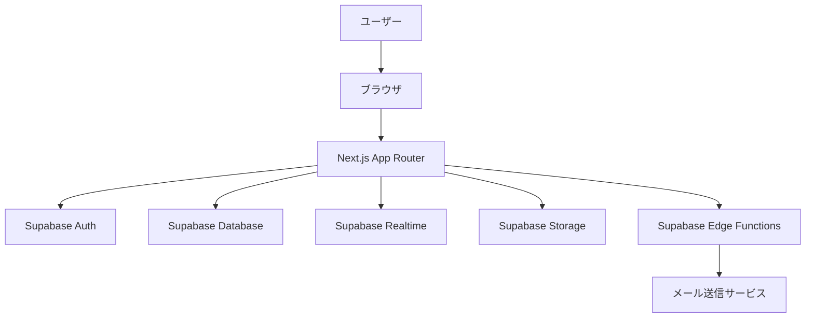
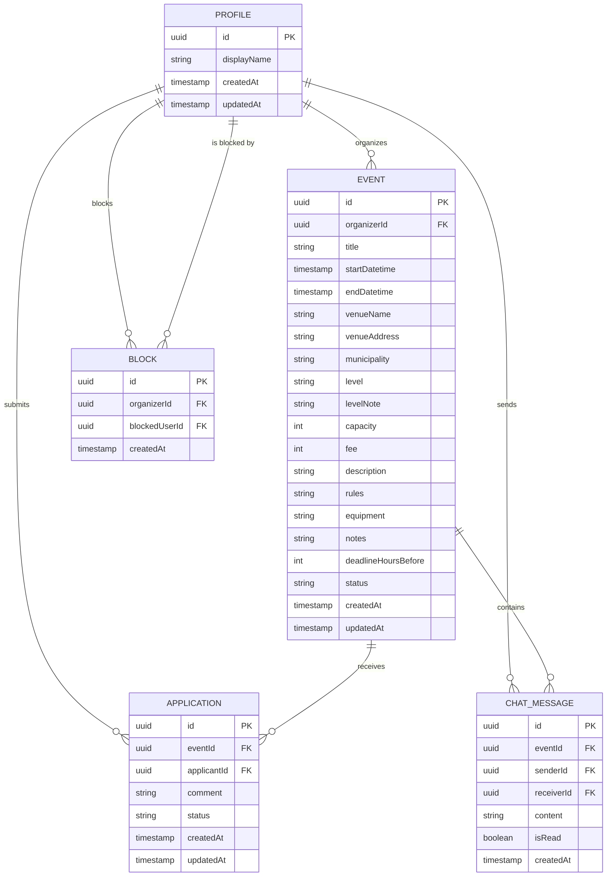
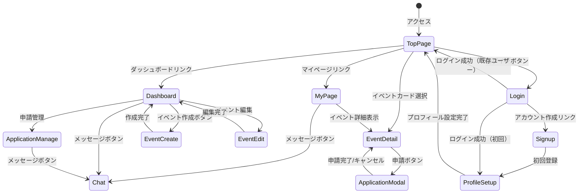
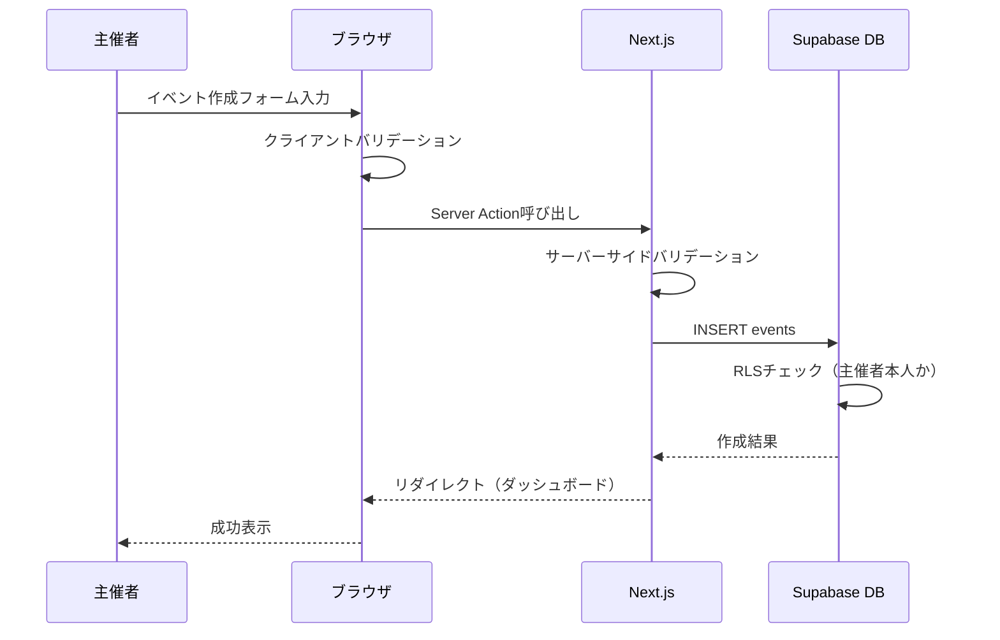
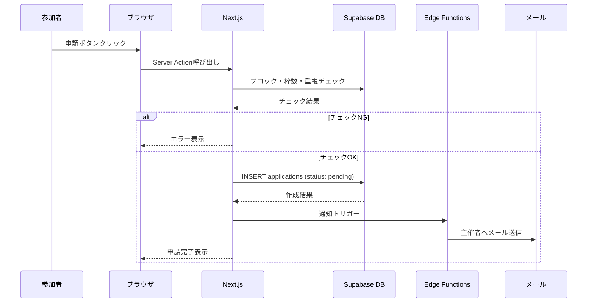
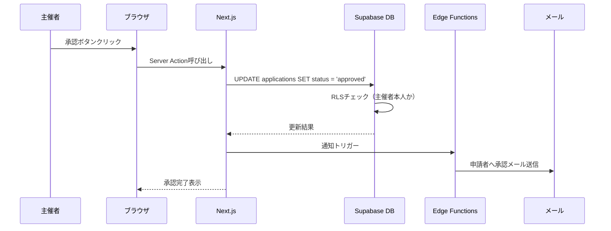
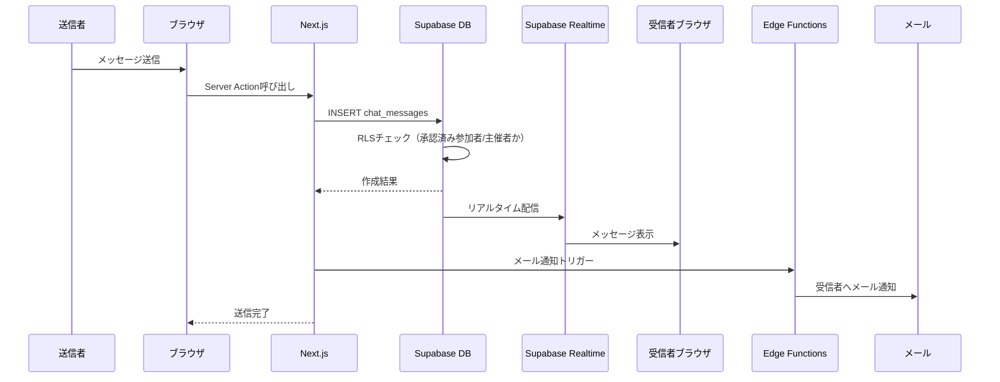

# 機能設計書 (Functional Design Document)

## システム構成図



## 技術スタック

| 分類 | 技術 | 選定理由 |
|------|------|----------|
| フロントエンド | Next.js (App Router) | SSR/SSG対応、SEO要件を満たす |
| 言語 | TypeScript | 型安全性、開発効率 |
| スタイリング | Tailwind CSS | モバイルファースト、高速開発 |
| UIライブラリ | shadcn/ui | カスタマイズ性、アクセシビリティ |
| 認証 | Supabase Auth | Google OAuth対応、メール認証 |
| データベース | PostgreSQL (Supabase) | RLS対応、リアルタイム機能 |
| リアルタイム | Supabase Realtime | チャット機能のWebSocket通信 |
| メール | Supabase Edge Functions + Resend | トランザクションメール送信 |
| ホスティング | Vercel | Next.jsとの親和性、エッジ配信 |

## データモデル定義

### エンティティ: Profile

```typescript
interface Profile {
  id: string;                // UUID (auth.usersのid)
  displayName: string;       // 表示名 (2〜20文字)
  createdAt: Date;           // 作成日時
  updatedAt: Date;           // 更新日時
}
```

**制約**:

| 制約 | 実装レベル | 実装方法 |
|------|-----------|---------|
| `id`は`auth.users`の外部キー | DB | `REFERENCES auth.users(id) ON DELETE CASCADE` |
| `displayName`は2〜20文字 | DB + App | DB: `CHECK (char_length(display_name) BETWEEN 2 AND 20)` / App: Zodスキーマ |
| 初回ログイン時に作成必須 | App | ミドルウェアでprofile存在チェック → 未作成なら`/profile/setup`へリダイレクト |

### エンティティ: Event

```typescript
interface Event {
  id: string;                    // UUID
  organizerId: string;           // 主催者ID (profiles.id)
  title: string;                 // タイトル (1〜100文字)
  startDatetime: Date;           // 開始日時
  endDatetime: Date;             // 終了日時
  venueName: string;             // 会場名
  venueAddress: string;          // 住所
  municipality: Municipality;    // 市区町村 (宮城県内38箇所)
  level: EventLevel;             // レベル
  levelNote?: string;            // レベル補足メモ
  capacity: number;              // 定員（ビジター枠）
  fee: number;                   // 参加費（円）
  description?: string;          // 説明文
  rules?: string;                // 参加ルール
  equipment?: string;            // 持ち物・装備
  notes?: string;                // 備考
  deadlineHoursBefore?: number;  // 募集締切（開始の何時間前か、1〜72）
  status: EventStatus;           // ステータス
  createdAt: Date;               // 作成日時
  updatedAt: Date;               // 更新日時
}

type EventLevel = 'beginner' | 'elementary' | 'intermediate' | 'advanced' | 'all';
type EventStatus = 'published' | 'cancelled';
```

**制約**:

| 制約 | 実装レベル | 実装方法 |
|------|-----------|---------|
| `endDatetime` > `startDatetime` | DB + App | DB: `CHECK (end_datetime > start_datetime)` / App: Zodスキーマ `.refine()` |
| `capacity` >= 1 | DB + App | DB: `CHECK (capacity >= 1)` / App: Zodスキーマ `.min(1)` |
| `fee` >= 0 | DB + App | DB: `CHECK (fee >= 0)` / App: Zodスキーマ `.min(0)` |
| `deadlineHoursBefore`は1〜72の整数（任意） | DB + App | DB: `CHECK (deadline_hours_before IS NULL OR deadline_hours_before BETWEEN 1 AND 72)` / App: Zodスキーマ |
| イベント開始後は編集不可 | App + RLS | RLSポリシー: `start_datetime > now()` を条件に含める / App: Server Actionで事前チェック |

### エンティティ: Application

```typescript
interface Application {
  id: string;                    // UUID
  eventId: string;               // イベントID
  applicantId: string;           // 申請者ID (profiles.id)
  comment?: string;              // コメント（任意）
  status: ApplicationStatus;     // ステータス
  createdAt: Date;               // 作成日時
  updatedAt: Date;               // 更新日時
}

type ApplicationStatus = 'pending' | 'approved' | 'rejected' | 'cancelled';
```

**制約**:

| 制約 | 実装レベル | 実装方法 |
|------|-----------|---------|
| 同一ユーザーが同一イベントに`pending`/`approved`の申請を複数持てない | DB | `CREATE UNIQUE INDEX unique_active_application ON applications(event_id, applicant_id) WHERE status IN ('pending', 'approved')` |
| 主催者自身は申請不可 | App + RLS | RLSポリシー: `applicant_id != event.organizer_id` / App: Server Actionで事前チェック |
| ブロックされているユーザーは申請不可 | App | Server Actionでblocksテーブルを参照しチェック |
| 残り枠がない場合は申請不可 | App | Server Actionで承認済み申請数とcapacityを比較 |

### エンティティ: ChatMessage

```typescript
interface ChatMessage {
  id: string;                    // UUID
  eventId: string;               // イベントID
  senderId: string;              // 送信者ID (profiles.id)
  receiverId: string;            // 受信者ID (profiles.id)
  content: string;               // メッセージ内容（1〜500文字）
  isRead: boolean;               // 既読フラグ
  createdAt: Date;               // 作成日時
}
```

**制約**:

| 制約 | 実装レベル | 実装方法 |
|------|-----------|---------|
| 送信者は主催者または承認済み参加者のみ | RLS | RLSポリシーで`sender_id`が主催者または承認済み申請者であることをチェック |
| イベント終了後48時間を超えたら送信不可 | App + RLS | RLSポリシー: `event.end_datetime + interval '48 hours' > now()` / App: Server Actionで事前チェック |
| ブロックされているユーザーは送信不可 | App | Server Actionでblocksテーブルを参照しチェック |

### エンティティ: Block

```typescript
interface Block {
  id: string;                    // UUID
  organizerId: string;           // ブロックした主催者ID
  blockedUserId: string;         // ブロックされたユーザーID
  createdAt: Date;               // 作成日時
}
```

**制約**:

| 制約 | 実装レベル | 実装方法 |
|------|-----------|---------|
| 同一ペアの重複ブロック不可 | DB | `UNIQUE (organizer_id, blocked_user_id)` |
| 自分自身をブロック不可 | DB + App | DB: `CHECK (organizer_id != blocked_user_id)` / App: Server Actionで事前チェック |

### ER図



## 画面遷移図



## 主要ユースケース

### ユースケース1: イベント作成



### ユースケース2: 参加申請



### ユースケース3: 申請承認



### ユースケース4: チャットメッセージ送信



## API設計（Server Actions）

Supabase + Next.js App Routerの構成のため、RESTful APIではなくServer Actionsを使用する。
データアクセスはSupabase Client経由で行い、RLSによりセキュリティを担保する。

### 標準返り値パターン

すべてのServer Actionsは以下の統一された返り値型を使用する:

```typescript
type ActionResult<T = void> =
  | { success: true; data: T }
  | { success: false; error: string; code: ErrorCode };

type ErrorCode =
  | 'VALIDATION_ERROR'      // 入力バリデーションエラー
  | 'AUTH_ERROR'             // 認証エラー
  | 'PERMISSION_ERROR'       // 権限エラー
  | 'NOT_FOUND'              // リソースが見つからない
  | 'CONFLICT'               // 競合（重複申請、定員オーバー等）
  | 'BUSINESS_RULE_ERROR'    // ビジネスルール違反（締切超過、ブロック等）
  | 'INTERNAL_ERROR';        // サーバー内部エラー
```

### イベント関連

| アクション | 入力型 | 返り値型 | 認証 | 主なエラー |
|-----------|--------|---------|------|-----------|
| `createEvent(data)` | `EventCreateInput` | `ActionResult<{ eventId: string }>` | 必須 | `VALIDATION_ERROR` |
| `updateEvent(id, data)` | `string, EventUpdateInput` | `ActionResult` | 必須（主催者のみ） | `PERMISSION_ERROR`, `BUSINESS_RULE_ERROR`（開始後編集不可） |
| `cancelEvent(id)` | `string` | `ActionResult` | 必須（主催者のみ） | `PERMISSION_ERROR` |
| `getEvents(filters)` | `EventFilterInput` | `ActionResult<{ events: Event[], totalCount: number }>` | 不要 | - |
| `getEventById(id)` | `string` | `ActionResult<{ event: EventDetail }>` | 不要 | `NOT_FOUND` |

**入力型の定義**（Zodスキーマで実装、`src/lib/validations/event.ts`に配置）:

```typescript
// EventCreateInput / EventUpdateInput
interface EventCreateInput {
  title: string;                   // 1〜100文字
  startDatetime: string;           // ISO 8601形式
  endDatetime: string;             // ISO 8601形式、startDatetimeより後
  venueName: string;               // 1〜100文字
  venueAddress: string;            // 1〜200文字
  municipality: Municipality;      // 宮城県内38箇所のenum値
  level: EventLevel;               // 'beginner' | 'elementary' | 'intermediate' | 'advanced' | 'all'
  levelNote?: string;              // 0〜200文字
  capacity: number;                // 1以上の整数
  fee: number;                     // 0以上の整数
  description?: string;            // 0〜2000文字
  rules?: string;                  // 0〜1000文字
  equipment?: string;              // 0〜500文字
  notes?: string;                  // 0〜1000文字
  deadlineHoursBefore?: number;    // 1〜72の整数（任意）
}

// EventFilterInput
interface EventFilterInput {
  dateRange?: 'today' | 'this_week' | 'next_week' | 'this_month' | 'next_month' | { from: string; to: string };
  municipality?: Municipality;
  level?: EventLevel;
  page?: number;                   // 1以上（デフォルト: 1）
  perPage?: number;                // 1〜50（デフォルト: 20）
}
```

### 申請関連

| アクション | 入力型 | 返り値型 | 認証 | 主なエラー |
|-----------|--------|---------|------|-----------|
| `applyToEvent(data)` | `{ eventId: string, comment?: string }` | `ActionResult<{ applicationId: string }>` | 必須 | `CONFLICT`（重複/定員超過）, `BUSINESS_RULE_ERROR`（ブロック/締切/自分のイベント） |
| `cancelApplication(id)` | `string` | `ActionResult` | 必須（申請者のみ） | `PERMISSION_ERROR`, `NOT_FOUND` |
| `approveApplication(id)` | `string` | `ActionResult` | 必須（主催者のみ） | `PERMISSION_ERROR`, `CONFLICT`（定員超過） |
| `rejectApplication(data)` | `{ applicationId: string, block?: boolean }` | `ActionResult` | 必須（主催者のみ） | `PERMISSION_ERROR` |

### チャット関連

| アクション | 入力型 | 返り値型 | 認証 | 主なエラー |
|-----------|--------|---------|------|-----------|
| `sendMessage(data)` | `{ eventId: string, receiverId: string, content: string }` | `ActionResult<{ messageId: string }>` | 必須 | `BUSINESS_RULE_ERROR`（期限切れ/ブロック）, `PERMISSION_ERROR` |
| `getMessages(data)` | `{ eventId: string, otherUserId: string }` | `ActionResult<{ messages: ChatMessage[] }>` | 必須 | `PERMISSION_ERROR` |
| `markAsRead(id)` | `string` | `ActionResult` | 必須 | `PERMISSION_ERROR` |

### ブロック関連

| アクション | 入力型 | 返り値型 | 認証 | 主なエラー |
|-----------|--------|---------|------|-----------|
| `blockUser(userId)` | `string` | `ActionResult` | 必須（主催者のみ） | `CONFLICT`（重複ブロック）, `BUSINESS_RULE_ERROR`（自分自身） |

## UI設計

### ページ一覧

| パス | ページ名 | 認証 | 説明 |
|-----|---------|------|------|
| `/` | トップページ | 不要 | イベント一覧、フィルター |
| `/events/[id]` | イベント詳細 | 不要 | イベント情報、申請ボタン |
| `/events/new` | イベント作成 | 必須 | 作成フォーム |
| `/events/[id]/edit` | イベント編集 | 必須 | 編集フォーム |
| `/dashboard` | ダッシュボード | 必須 | 主催者向け管理画面 |
| `/dashboard/events/[id]/applications` | 申請管理 | 必須 | 申請一覧、承認/拒否 |
| `/my-page` | マイページ | 必須 | 参加者向け申請一覧 |
| `/chat/[eventId]/[userId]` | チャット | 必須 | 1対1メッセージ |
| `/profile/setup` | プロフィール設定 | 必須 | 初回・編集 |
| `/login` | ログイン | 不要 | ログイン/サインアップ |

### イベントカードの表示項目

| 項目 | 説明 | フォーマット |
|------|------|-------------|
| タイトル | イベント名 | テキスト |
| 日時 | 開始〜終了 | `MM/DD(曜日) HH:mm〜HH:mm` |
| 会場 | 会場名 | テキスト |
| 市区町村 | 地域 | バッジ |
| レベル | 対象レベル | バッジ（色分け） |
| 参加費 | 金額 | `¥X,XXX` |
| 残り枠 | 残り人数/定員 | `残りX枠 / 定員Y名` |
| 主催者 | 表示名 | テキスト |

### レベルバッジの色分け

| レベル | 色 | 用途 |
|--------|-----|------|
| 初心者 | 緑 | 未経験〜初心者 |
| 初級 | 青 | 基礎が身についたレベル |
| 中級 | 黄 | 試合経験があるレベル |
| 上級 | 赤 | 競技レベル |
| すべてのレベル | グレー | レベル不問 |

### 申請ステータスバッジの色分け

| ステータス | 色 | 表示テキスト |
|-----------|-----|-------------|
| pending | 黄 | 保留中 |
| approved | 緑 | 承認済み |
| rejected | 赤 | 拒否 |
| cancelled | グレー | キャンセル済み |

### 主要ページのコンポーネント構成

SC = Server Component / CC = Client Component

#### トップページ（`/`）

```
Page (SC) - イベント一覧ページ
├── Header (SC)
│   ├── Logo (SC)
│   ├── NotificationBadge (CC) - 未読チャット数・保留申請数
│   └── AuthButton (CC) - ログイン/ユーザーメニュー
├── EventFilter (CC) - 日付・市区町村・レベルフィルター（URLパラメータ連動）
├── EventList (SC) - フィルター条件でDB取得
│   └── EventCard[] (SC)
│       ├── LevelBadge (SC)
│       └── MunicipalityBadge (SC)
├── Pagination (CC) - ページ番号ナビゲーション
└── Footer (SC)
```

#### イベント詳細ページ（`/events/[id]`）

```
Page (SC) - ISRで静的生成
├── EventDetailCard (SC) - 全イベント情報表示
│   ├── LevelBadge (SC)
│   ├── MunicipalityBadge (SC)
│   └── OrganizerInfo (SC)
├── ApplicationSection (CC) - 申請状態に応じたボタン表示
│   └── ApplicationModal (CC) - コメント入力・送信
└── StructuredData (SC) - JSON-LD出力
```

#### ダッシュボード（`/dashboard`）

```
Page (SC) - 主催者向け管理画面
├── UpcomingEvents (SC) - 今後のイベント一覧
│   └── EventManageCard[] (SC) - ステータスバッジ・参加者数・クイックアクション
├── PastEvents (CC) - 過去イベント（折りたたみ表示）
└── EmptyState (SC) - イベント未作成時の誘導表示
```

#### チャットページ（`/chat/[eventId]/[userId]`）

```
Page (SC) - チャット画面
├── ChatHeader (SC) - 相手の表示名・イベント情報
├── MessageList (CC) - リアルタイム購読でメッセージ表示
│   └── MessageBubble[] (CC) - 送信/受信メッセージ・既読状態
├── QuickMessages (CC) - 定型文テンプレート選択
└── MessageInput (CC) - メッセージ入力・送信
```

## セキュリティ考慮事項

### Row Level Security (RLS) ポリシー

| テーブル | 操作 | ポリシー |
|---------|------|---------|
| profiles | SELECT | 全ユーザー閲覧可 |
| profiles | INSERT/UPDATE | 本人のみ |
| events | SELECT | 全ユーザー閲覧可 |
| events | INSERT | 認証済みユーザー |
| events | UPDATE/DELETE | 主催者のみ |
| applications | SELECT | 申請者本人または主催者 |
| applications | INSERT | 認証済みユーザー（制約チェック付き） |
| applications | UPDATE | 申請者本人（キャンセル）または主催者（承認/拒否） |
| chat_messages | SELECT | 送信者または受信者のみ |
| chat_messages | INSERT | 承認済み参加者または主催者 |
| blocks | SELECT | ブロックした主催者のみ |
| blocks | INSERT/DELETE | 主催者のみ |

### 入力バリデーション

- すべてのフォーム入力はクライアント側とサーバー側の両方でバリデーション（Zodスキーマを共有）
- SQLインジェクション対策: Supabase Clientのパラメータバインディング使用（直接SQLを書かない）
- XSS対策: Reactの自動エスケープ + DOMPurifyで追加サニタイズ
- CSRF対策: Server Actionsの組み込みCSRF保護（セッションベースのトークン検証が自動適用されるため、追加実装不要）

### Realtime購読パターン（チャット）

チャット機能ではSupabase Realtimeを使用してメッセージをリアルタイム配信する。

```typescript
// チャットページ（CC）でのRealtime購読パターン
useEffect(() => {
  const channel = supabase
    .channel(`chat:${eventId}:${userId}`)
    .on('postgres_changes', {
      event: 'INSERT',
      schema: 'sports_event_hub',
      table: 'chat_messages',
      filter: `event_id=eq.${eventId}`
    }, (payload) => {
      const newMessage = payload.new as ChatMessage;
      // 自分宛てまたは自分が送信したメッセージのみ表示
      if (newMessage.sender_id === currentUserId || newMessage.receiver_id === currentUserId) {
        setMessages(prev => [...prev, newMessage]);
      }
    })
    .subscribe();

  // コンポーネントアンマウント時にクリーンアップ
  return () => {
    supabase.removeChannel(channel);
  };
}, [eventId, userId, currentUserId]);
```

**購読ルール**:
- チャットページ表示中のみ購読（ページ離脱時にクリーンアップ）
- フィルタは`event_id`で絞り込み、クライアント側で`sender_id`/`receiver_id`を追加フィルタ
- 既読状態の更新にはRealtimeの`UPDATE`イベントも購読

## エラーハンドリング

### エラーの分類

| エラー種別 | ErrorCode | 処理 | ユーザーへの表示 |
|-----------|-----------|------|-----------------|
| 認証エラー | `AUTH_ERROR` | ログインページへリダイレクト | 「ログインしてください」 |
| 権限エラー | `PERMISSION_ERROR` | 処理中断 | 「この操作を行う権限がありません」 |
| バリデーションエラー | `VALIDATION_ERROR` | フォームにエラー表示 | 各フィールドのエラーメッセージ |
| 定員オーバー | `CONFLICT` | 申請を拒否 | 「定員に達しています」 |
| 募集締切 | `BUSINESS_RULE_ERROR` | 申請を拒否 | 「募集は締め切られました」 |
| ブロック済み | `BUSINESS_RULE_ERROR` | 申請を拒否 | 「この練習会には申請できません」 |
| イベント開始後の編集 | `BUSINESS_RULE_ERROR` | 編集を拒否 | 「開始済みのイベントは編集できません」 |
| チャット期限切れ | `BUSINESS_RULE_ERROR` | 送信を拒否 | 「チャット期限が終了しました」 |
| ネットワークエラー | - | リトライ促進 | 「通信エラーが発生しました。再度お試しください」 |

### Server Actionsの実装パターン

```typescript
// Server Action の標準実装パターン（src/actions/ 内の各ファイルで使用）
'use server';

export async function createEvent(
  data: EventCreateInput
): Promise<ActionResult<{ eventId: string }>> {
  // 1. 認証チェック
  const user = await getAuthUser();
  if (!user) {
    return { success: false, error: 'ログインしてください', code: 'AUTH_ERROR' };
  }

  // 2. バリデーション（Zodスキーマ）
  const parsed = eventCreateSchema.safeParse(data);
  if (!parsed.success) {
    return { success: false, error: parsed.error.issues[0].message, code: 'VALIDATION_ERROR' };
  }

  // 3. ビジネスロジック実行 + DB操作
  const { data: event, error } = await supabase
    .from('events')
    .insert({ ...parsed.data, organizer_id: user.id })
    .select('id')
    .single();

  if (error) {
    return { success: false, error: 'イベントの作成に失敗しました', code: 'INTERNAL_ERROR' };
  }

  // 4. 副作用（メール通知等）
  // ...

  // 5. revalidate & 返却
  revalidatePath('/dashboard');
  return { success: true, data: { eventId: event.id } };
}
```

### クライアント側のエラーハンドリング

```typescript
// フォームでのServer Action呼び出しパターン
const result = await createEvent(formData);

if (!result.success) {
  switch (result.code) {
    case 'VALIDATION_ERROR':
      // フォームフィールドにエラー表示
      break;
    case 'AUTH_ERROR':
      // ログインページへリダイレクト
      redirect('/login');
      break;
    default:
      // トースト通知でエラーメッセージ表示
      toast.error(result.error);
      break;
  }
}
```

## パフォーマンス最適化

※ パフォーマンス目標値の詳細は [architecture.md](./architecture.md) の「パフォーマンス要件」を参照。

| 手法 | 対象 | 達成目標（architecture.md参照） | 効果 |
|------|------|-------------------------------|------|
| ページネーション | イベント一覧 | 一覧表示500ms以内 | 1回のクエリで20件に制限し、レスポンス時間を短縮 |
| SSR / SSG | トップページ | 初回ページロード3秒以内（3G） | サーバーサイドでHTML生成し、初回表示を高速化 |
| ISR | イベント詳細ページ | ページ遷移1秒以内 | 静的キャッシュ + オンデマンド再生成で高速表示 |
| React Server Components | データ取得コンポーネント | ページ遷移1秒以内 | クライアントへのJS送信量削減 |
| Database Index | 検索・フィルタ対象カラム | 検索1秒以内 | `start_datetime`, `municipality`, `level`等にインデックス |
| Supabase Realtime | チャット | メッセージ配信500ms以内 | ポーリング不要でリアルタイム配信 |
| Next.js Image | 画像表示 | 初回ページロード3秒以内（3G） | 自動最適化・遅延読み込み |

### ページネーション仕様

- **方式**: 番号付きページネーション（1, 2, 3... 形式）
- **理由**: SEO対応（各ページに固有URL）、スクロール位置の保持が容易
- **1ページあたり**: 20件
- **URL形式**: `/?page=2&municipality=sendai&level=intermediate`（検索パラメータ）

## テスト戦略

### ユニットテスト

**対象**: バリデーションロジック、日時計算、ステータス遷移ロジック

**テストケース例**:
- イベント作成バリデーション: `endDatetime` < `startDatetime` → エラー
- 募集締切判定: イベント開始72時間前、`deadlineHoursBefore=72` → 申請可能（境界値）
- 募集締切判定: イベント開始71時間59分前、`deadlineHoursBefore=72` → 申請不可
- チャット期限判定: イベント終了48時間後 → 送信可能（境界値）
- チャット期限判定: イベント終了48時間1分後 → 送信不可
- 申請制約: 残り枠0の場合 → `CONFLICT`エラー
- 申請制約: 主催者自身が申請 → `BUSINESS_RULE_ERROR`エラー

### 統合テスト

**対象**: Server Actions、RLSポリシー、Database Functions

**テストケース例**:
- `createEvent`: 正常系 → イベント作成成功、DBに保存
- `createEvent`: 未認証 → `AUTH_ERROR`
- `applyToEvent`: 重複申請 → `CONFLICT`
- `approveApplication`: 他人のイベントの申請を承認 → `PERMISSION_ERROR`（RLSで拒否）
- `sendMessage`: イベント終了48時間超過 → `BUSINESS_RULE_ERROR`
- RLS: 他ユーザーのチャットメッセージ → SELECT結果が空

### E2Eテスト

**シナリオ**:
- イベント作成〜公開フロー: フォーム入力 → 作成 → ダッシュボードに表示 → トップページに表示
- 申請〜承認フロー: 参加者が申請 → 主催者が承認 → 参加者に承認メール → チャット利用可能
- チャットメッセージ送受信フロー: 送信 → リアルタイムで受信者に表示 → 既読マーク
- ログイン〜プロフィール設定フロー: メール登録 → メール認証 → プロフィール設定 → トップページ
