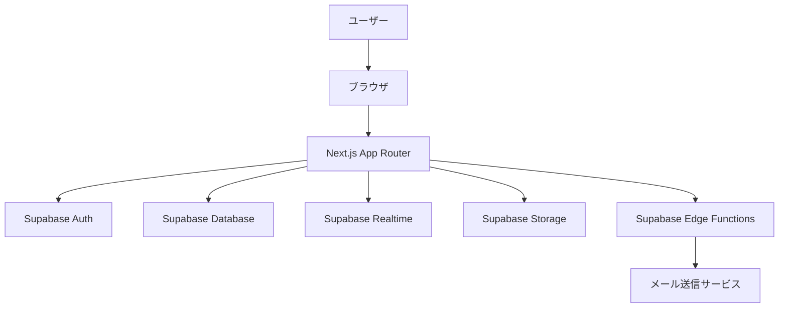
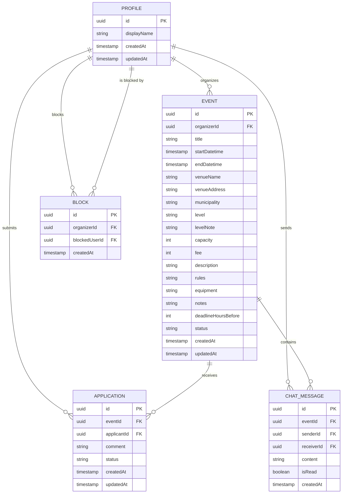
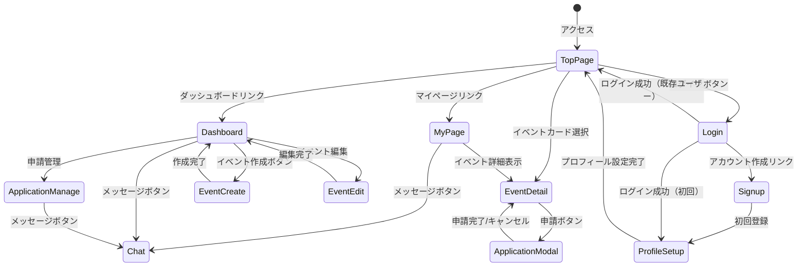
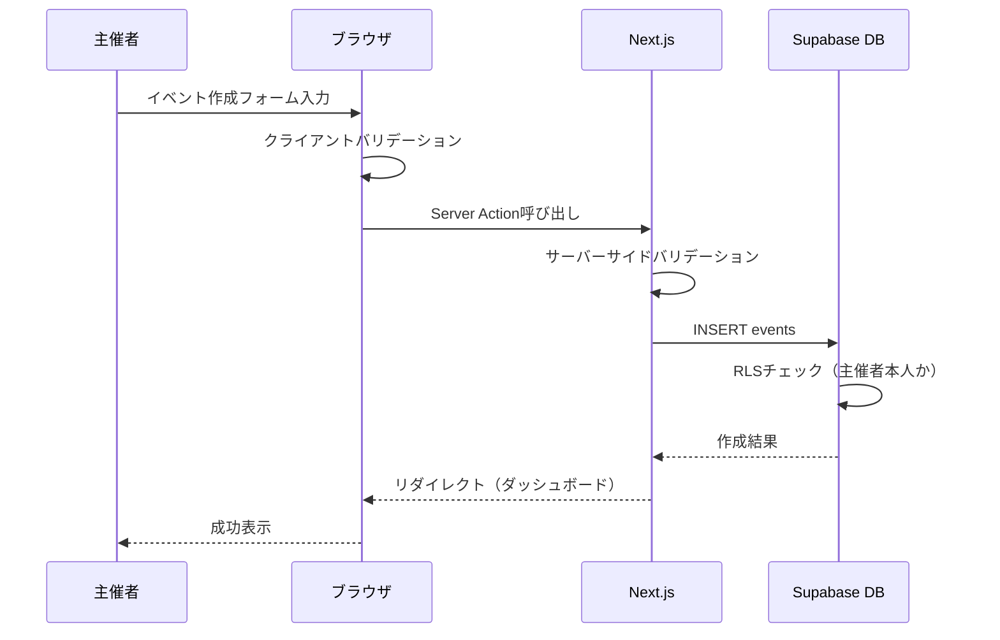
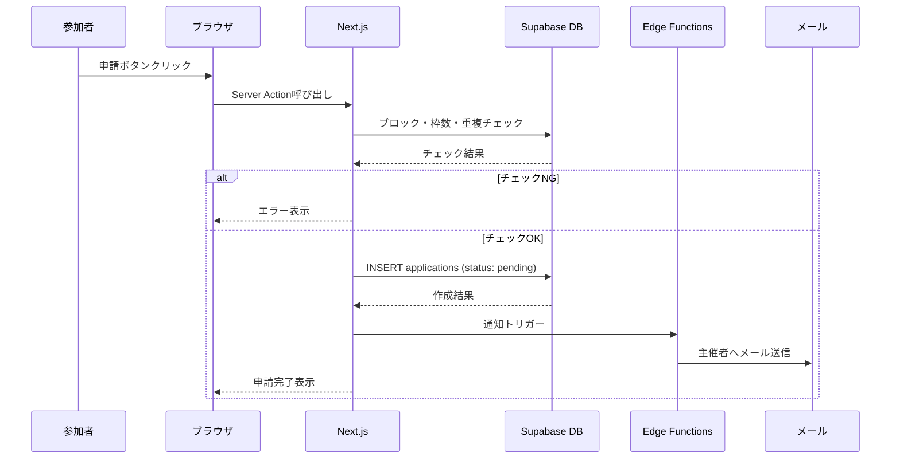
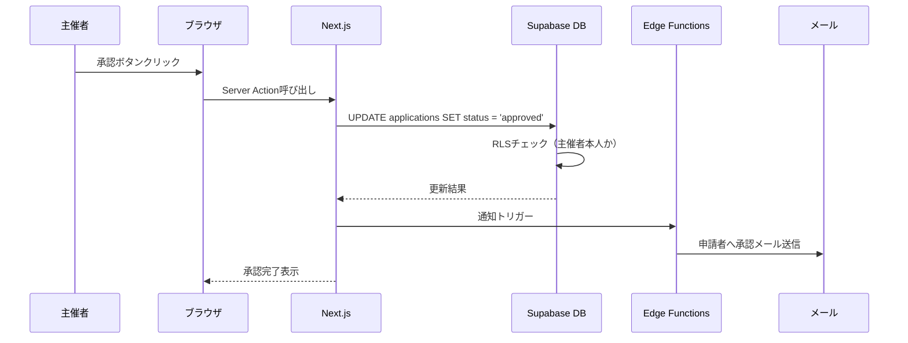
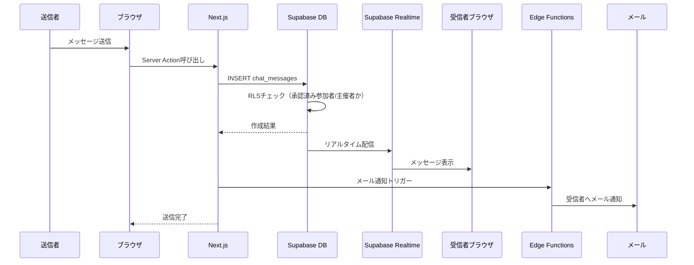

# 機能設計書 (Functional Design Document)

## システム構成図



## 技術スタック

| 分類 | 技術 | 選定理由 |
|------|------|----------|
| フロントエンド | Next.js (App Router) | SSR/SSG対応、SEO要件を満たす |
| 言語 | TypeScript | 型安全性、開発効率 |
| スタイリング | Tailwind CSS | モバイルファースト、高速開発 |
| UIライブラリ | shadcn/ui | カスタマイズ性、アクセシビリティ |
| 認証 | Supabase Auth | Google OAuth対応、メール認証 |
| データベース | PostgreSQL (Supabase) | RLS対応、リアルタイム機能 |
| リアルタイム | Supabase Realtime | チャット機能のWebSocket通信 |
| メール | Supabase Edge Functions + Resend | トランザクションメール送信 |
| ホスティング | Vercel | Next.jsとの親和性、エッジ配信 |

## データモデル定義

### エンティティ: Profile

```typescript
interface Profile {
  id: string;                // UUID (auth.usersのid)
  displayName: string;       // 表示名 (2〜20文字)
  createdAt: Date;           // 作成日時
  updatedAt: Date;           // 更新日時
}
```

**制約**:
- `id`は`auth.users`の外部キー
- `displayName`は2〜20文字
- 初回ログイン時に作成必須

### エンティティ: Event

```typescript
interface Event {
  id: string;                    // UUID
  organizerId: string;           // 主催者ID (profiles.id)
  title: string;                 // タイトル (1〜100文字)
  startDatetime: Date;           // 開始日時
  endDatetime: Date;             // 終了日時
  venueName: string;             // 会場名
  venueAddress: string;          // 住所
  municipality: Municipality;    // 市区町村 (宮城県内38箇所)
  level: EventLevel;             // レベル
  levelNote?: string;            // レベル補足メモ
  capacity: number;              // 定員（ビジター枠）
  fee: number;                   // 参加費（円）
  description?: string;          // 説明文
  rules?: string;                // 参加ルール
  equipment?: string;            // 持ち物・装備
  notes?: string;                // 備考
  deadlineHoursBefore?: number;  // 募集締切（開始の何時間前か、1〜72）
  status: EventStatus;           // ステータス
  createdAt: Date;               // 作成日時
  updatedAt: Date;               // 更新日時
}

type EventLevel = 'beginner' | 'elementary' | 'intermediate' | 'advanced' | 'all';
type EventStatus = 'published' | 'cancelled';
```

**制約**:
- `endDatetime` > `startDatetime`
- `capacity` >= 1
- `fee` >= 0
- `deadlineHoursBefore`は1〜72の整数（任意）
- イベント開始後は編集不可

### エンティティ: Application

```typescript
interface Application {
  id: string;                    // UUID
  eventId: string;               // イベントID
  applicantId: string;           // 申請者ID (profiles.id)
  comment?: string;              // コメント（任意）
  status: ApplicationStatus;     // ステータス
  createdAt: Date;               // 作成日時
  updatedAt: Date;               // 更新日時
}

type ApplicationStatus = 'pending' | 'approved' | 'rejected' | 'cancelled';
```

**制約**:
- 同一ユーザーが同一イベントに`pending`または`approved`の申請を複数持てない
- 主催者自身は申請不可
- ブロックされているユーザーは申請不可
- 残り枠がない場合は申請不可

### エンティティ: ChatMessage

```typescript
interface ChatMessage {
  id: string;                    // UUID
  eventId: string;               // イベントID
  senderId: string;              // 送信者ID (profiles.id)
  receiverId: string;            // 受信者ID (profiles.id)
  content: string;               // メッセージ内容（1〜500文字）
  isRead: boolean;               // 既読フラグ
  createdAt: Date;               // 作成日時
}
```

**制約**:
- 送信者は主催者または承認済み参加者のみ
- イベント終了後48時間を超えたら新規メッセージ送信不可
- ブロックされているユーザーはメッセージ送信不可

### エンティティ: Block

```typescript
interface Block {
  id: string;                    // UUID
  organizerId: string;           // ブロックした主催者ID
  blockedUserId: string;         // ブロックされたユーザーID
  createdAt: Date;               // 作成日時
}
```

**制約**:
- 同一ペアの重複ブロック不可
- 自分自身をブロック不可

### ER図



## 画面遷移図



## 主要ユースケース

### ユースケース1: イベント作成



### ユースケース2: 参加申請



### ユースケース3: 申請承認



### ユースケース4: チャットメッセージ送信



## API設計（Server Actions）

Supabase + Next.js App Routerの構成のため、RESTful APIではなくServer Actionsを使用する。
データアクセスはSupabase Client経由で行い、RLSによりセキュリティを担保する。

### イベント関連

| アクション | 説明 | 認証 |
|-----------|------|------|
| `createEvent(data)` | イベント作成 | 必須 |
| `updateEvent(id, data)` | イベント編集 | 必須（主催者のみ） |
| `cancelEvent(id)` | イベントキャンセル | 必須（主催者のみ） |
| `getEvents(filters)` | イベント一覧取得 | 不要 |
| `getEventById(id)` | イベント詳細取得 | 不要 |

### 申請関連

| アクション | 説明 | 認証 |
|-----------|------|------|
| `applyToEvent(eventId, comment?)` | 参加申請 | 必須 |
| `cancelApplication(applicationId)` | 申請キャンセル | 必須（申請者のみ） |
| `approveApplication(applicationId)` | 申請承認 | 必須（主催者のみ） |
| `rejectApplication(applicationId, block?)` | 申請拒否 | 必須（主催者のみ） |

### チャット関連

| アクション | 説明 | 認証 |
|-----------|------|------|
| `sendMessage(eventId, receiverId, content)` | メッセージ送信 | 必須 |
| `getMessages(eventId, otherUserId)` | メッセージ取得 | 必須 |
| `markAsRead(messageId)` | 既読にする | 必須 |

### ブロック関連

| アクション | 説明 | 認証 |
|-----------|------|------|
| `blockUser(userId)` | ユーザーブロック | 必須（主催者のみ） |

## UI設計

### ページ一覧

| パス | ページ名 | 認証 | 説明 |
|-----|---------|------|------|
| `/` | トップページ | 不要 | イベント一覧、フィルター |
| `/events/[id]` | イベント詳細 | 不要 | イベント情報、申請ボタン |
| `/events/new` | イベント作成 | 必須 | 作成フォーム |
| `/events/[id]/edit` | イベント編集 | 必須 | 編集フォーム |
| `/dashboard` | ダッシュボード | 必須 | 主催者向け管理画面 |
| `/dashboard/events/[id]/applications` | 申請管理 | 必須 | 申請一覧、承認/拒否 |
| `/mypage` | マイページ | 必須 | 参加者向け申請一覧 |
| `/chat/[eventId]/[userId]` | チャット | 必須 | 1対1メッセージ |
| `/profile/setup` | プロフィール設定 | 必須 | 初回・編集 |
| `/login` | ログイン | 不要 | ログイン/サインアップ |

### イベントカードの表示項目

| 項目 | 説明 | フォーマット |
|------|------|-------------|
| タイトル | イベント名 | テキスト |
| 日時 | 開始〜終了 | `MM/DD(曜日) HH:mm〜HH:mm` |
| 会場 | 会場名 | テキスト |
| 市区町村 | 地域 | バッジ |
| レベル | 対象レベル | バッジ（色分け） |
| 参加費 | 金額 | `¥X,XXX` |
| 残り枠 | 残り人数/定員 | `残りX枠 / 定員Y名` |
| 主催者 | 表示名 | テキスト |

### レベルバッジの色分け

| レベル | 色 | 用途 |
|--------|-----|------|
| 初心者 | 緑 | 未経験〜初心者 |
| 初級 | 青 | 基礎が身についたレベル |
| 中級 | 黄 | 試合経験があるレベル |
| 上級 | 赤 | 競技レベル |
| すべてのレベル | グレー | レベル不問 |

### 申請ステータスバッジの色分け

| ステータス | 色 | 表示テキスト |
|-----------|-----|-------------|
| pending | 黄 | 保留中 |
| approved | 緑 | 承認済み |
| rejected | 赤 | 拒否 |
| cancelled | グレー | キャンセル済み |

## セキュリティ考慮事項

### Row Level Security (RLS) ポリシー

| テーブル | 操作 | ポリシー |
|---------|------|---------|
| profiles | SELECT | 全ユーザー閲覧可 |
| profiles | INSERT/UPDATE | 本人のみ |
| events | SELECT | 全ユーザー閲覧可 |
| events | INSERT | 認証済みユーザー |
| events | UPDATE/DELETE | 主催者のみ |
| applications | SELECT | 申請者本人または主催者 |
| applications | INSERT | 認証済みユーザー（制約チェック付き） |
| applications | UPDATE | 申請者本人（キャンセル）または主催者（承認/拒否） |
| chat_messages | SELECT | 送信者または受信者のみ |
| chat_messages | INSERT | 承認済み参加者または主催者 |
| blocks | SELECT | ブロックした主催者のみ |
| blocks | INSERT/DELETE | 主催者のみ |

### 入力バリデーション

- すべてのフォーム入力はクライアント側とサーバー側の両方でバリデーション
- SQLインジェクション対策: Supabase Clientのパラメータバインディング使用
- XSS対策: Reactの自動エスケープ + DOMPurifyで追加サニタイズ
- CSRF対策: Server Actionsの組み込みCSRF保護

## エラーハンドリング

### エラーの分類

| エラー種別 | 処理 | ユーザーへの表示 |
|-----------|------|-----------------|
| 認証エラー | ログインページへリダイレクト | 「ログインしてください」 |
| 権限エラー | 処理中断 | 「この操作を行う権限がありません」 |
| バリデーションエラー | フォームにエラー表示 | 各フィールドのエラーメッセージ |
| 定員オーバー | 申請を拒否 | 「定員に達しています」 |
| 募集締切 | 申請を拒否 | 「募集は締め切られました」 |
| ブロック済み | 申請を拒否 | 「この練習会には申請できません」 |
| イベント開始後の編集 | 編集を拒否 | 「開始済みのイベントは編集できません」 |
| チャット期限切れ | 送信を拒否 | 「チャット期限が終了しました」 |
| ネットワークエラー | リトライ促進 | 「通信エラーが発生しました。再度お試しください」 |

## パフォーマンス最適化

- イベント一覧: ページネーション（1ページ20件）
- 画像最適化: Next.js Image コンポーネント使用
- 静的生成: イベント詳細ページのISR（Incremental Static Regeneration）
- データキャッシュ: React Server Components のキャッシュ活用
- チャット: Supabase Realtimeによる差分更新（ポーリング不要）

## テスト戦略

### ユニットテスト
- バリデーションロジック（イベント作成、申請制約チェック）
- 日時計算（募集締切判定、チャット期限判定）
- ステータス遷移ロジック

### 統合テスト
- Server Actionsの入出力テスト
- RLSポリシーの権限テスト
- メール通知トリガーのテスト

### E2Eテスト
- イベント作成〜公開フロー
- 申請〜承認フロー
- チャットメッセージ送受信フロー
- ログイン〜プロフィール設定フロー
