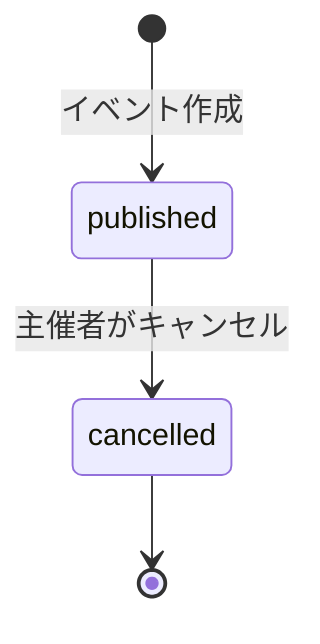
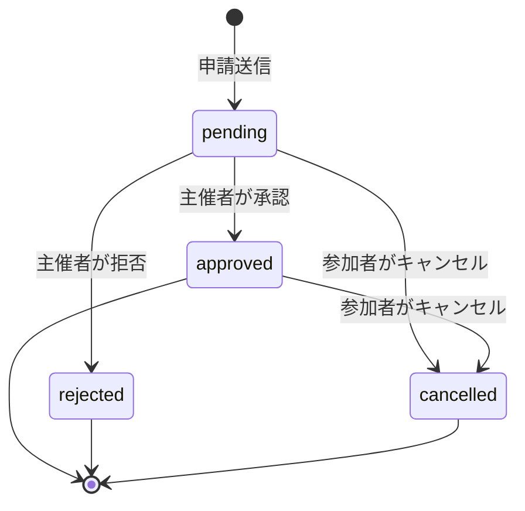

# プロジェクト用語集 (Glossary)

## 概要

このドキュメントは、Badminton Event Hubプロジェクト内で使用される用語の定義を管理します。

**更新日**: 2026-02-06

## 用語の使い分けガイド

### イベント vs 練習会

| コンテキスト | 使用する用語 | 例 |
|---|---|---|
| コード・API | `Event` | `createEvent()`, `EventCard` |
| UI・ユーザー向けテキスト | 練習会 | 「練習会を作成する」 |
| ドキュメント | イベント（練習会） | 「イベント（練習会）の管理機能」 |

### 参加者 vs 申請者

| コンテキスト | 使用する用語 | 説明 |
|---|---|---|
| 申請中（pending） | 申請者 | まだ参加が確定していない |
| 承認後（approved） | 参加者 | 参加が確定した |
| コード・DB | `applicant` | ステータスに関わらず統一 |

## ドメイン用語

### イベント（練習会）

**定義**: 主催者がバドミントンの練習会として作成・公開する催しの単位

**説明**:
タイトル、日時、会場、レベル、定員、参加費などの情報を持つ。主催者が作成・編集・キャンセルでき、参加者は申請を通じて参加する。「イベント」と「練習会」は同義で使用するが、コード上では `Event` を使用する。

**関連用語**: [主催者](#主催者)、[参加者（申請者）](#参加者申請者)、[申請](#申請)

**使用例**:
- 「イベントを作成する」: 新しい練習会を登録・公開する
- 「イベントをキャンセルする」: 練習会の開催を中止する

**英語表記**: Event

### 主催者

**定義**: イベント（練習会）を作成・管理するユーザー

**説明**:
イベントの作成、編集、キャンセル、参加申請の承認・拒否、参加者のブロックを行う権限を持つ。1人のユーザーが複数のイベントを主催できる。コード上では `organizer` を使用する。

**関連用語**: [イベント](#イベント練習会)、[ダッシュボード](#ダッシュボード)、[ブロック](#ブロック)

**英語表記**: Organizer

### 参加者（申請者）

**定義**: イベントに参加申請を行うユーザー

**説明**:
イベント一覧から練習会を探し、申請を通じて参加する。同一ユーザーが主催者と参加者の両方の役割を持つことができる（異なるイベントにおいて）。申請中は「申請者」、承認後は「参加者」と呼ぶが、コード上では一貫して `applicant` を使用する。

**関連用語**: [申請](#申請)、[マイページ](#マイページ)

**英語表記**: Applicant

### 申請

**定義**: 参加者がイベントへの参加を希望する際に送信するリクエスト

**説明**:
任意のコメントを添えて送信できる。主催者の承認を経て参加が確定する。コード上では `Application` を使用する。

**関連用語**: [イベント](#イベント練習会)、[参加者（申請者）](#参加者申請者)、[主催者](#主催者)

**英語表記**: Application

### ブロック

**定義**: 主催者が特定のユーザーに対して、自身の全イベントへの申請を禁止する機能

**説明**:
ブロックされたユーザーはその主催者の全イベントに対して申請不可となり、チャットアクセスも制限される。ブロックされたことは相手に表示される。コード上では `Block` を使用する。

**関連用語**: [主催者](#主催者)、[申請](#申請)

**英語表記**: Block

### ダッシュボード

**定義**: 主催者向けのイベント管理画面

**説明**:
今後のイベント一覧、過去のイベント一覧、保留中の申請数バッジなどを表示する。イベントの作成・編集・キャンセルへのクイックアクションを提供する。

**関連用語**: [主催者](#主催者)、[イベント](#イベント練習会)

**英語表記**: Dashboard

### マイページ

**定義**: 参加者向けの申請状況確認画面

**説明**:
自身の申請一覧をステータス別（保留中/承認済み/拒否/キャンセル）に表示する。イベント詳細の閲覧、主催者へのメッセージ、参加キャンセルなどのアクションを提供する。

**関連用語**: [参加者（申請者）](#参加者申請者)、[申請](#申請)

**英語表記**: My Page (パス: `/my-page`)

### レベル

**定義**: イベント参加者に求められるバドミントンの技術水準

**説明**:
5段階で定義される。主催者がイベント作成時に選択し、参加者がフィルターとして使用する。

**値の定義**:
| 値 | コード値 | 説明 |
|---|---|---|
| 初心者 | `beginner` | 未経験〜バドミントンを始めたばかり |
| 初級 | `elementary` | 基礎が身についたレベル |
| 中級 | `intermediate` | 試合経験があるレベル |
| 上級 | `advanced` | 競技レベル |
| すべてのレベル | `all` | レベル不問 |

**実装箇所**: `src/lib/constants/levels.ts`

**関連用語**: [イベント](#イベント練習会)

**英語表記**: Level

### 市区町村

**定義**: イベントが開催される宮城県内の地域区分

**説明**:
宮城県内38箇所の市区町村から選択する。イベント検索のフィルターとしても使用される。コード上では `municipality` を使用する。

**主な値の例**: 仙台市青葉区、仙台市宮城野区、仙台市太白区、仙台市泉区、石巻市、名取市 等

**実装箇所**: `src/lib/constants/municipalities.ts`

**関連用語**: [イベント](#イベント練習会)

**英語表記**: Municipality

### 募集締切

**定義**: イベント開始の一定時間前に設定される、申請受付の期限

**説明**:
任意設定。イベント開始の1〜72時間前から選択可能。締切を過ぎると新規申請ができなくなる。コード上では `deadlineHoursBefore` を使用する。

**関連用語**: [イベント](#イベント練習会)、[申請](#申請)

**英語表記**: Application Deadline

### クイックメッセージ

**定義**: チャットで使用できる定型文テンプレート

**説明**:
よく使うメッセージをワンタップで送信できる機能。「迷っています」「遅れます」「体調不良でキャンセル」などのテンプレートが用意されている。

**実装箇所**: `src/lib/constants/quick-messages.ts`

**関連用語**: [チャット](#チャット)

**英語表記**: Quick Message

### チャット

**定義**: 承認済み参加者と主催者間の1対1リアルタイムメッセージ機能

**説明**:
メッセージ上限500文字。既読状態のトラッキングあり。イベント終了後48時間でチャット期限切れとなり、新規メッセージ送信不可になる。

**関連用語**: [クイックメッセージ](#クイックメッセージ)、[主催者](#主催者)、[参加者（申請者）](#参加者申請者)

**英語表記**: Chat

## ステータス・状態

### イベントステータス (EventStatus)

**定義**: イベントの公開状態を示す値

| ステータス | コード値 | 意味 | 遷移条件 |
|----------|---------|------|---------|
| 公開中 | `published` | 参加申請を受付可能 | イベント作成時の初期状態 |
| キャンセル済み | `cancelled` | 開催中止 | 主催者がキャンセル |

**状態遷移図**:


### 申請ステータス (ApplicationStatus)

**定義**: 参加申請の処理状態を示す値

| ステータス | コード値 | 意味 | 遷移条件 |
|----------|---------|------|---------|
| 保留中 | `pending` | 主催者の承認待ち | 申請送信時の初期状態 |
| 承認済み | `approved` | 参加が確定 | 主催者が承認 |
| 拒否 | `rejected` | 申請が却下された | 主催者が拒否 |
| キャンセル済み | `cancelled` | 参加者が取り下げた | 参加者がキャンセル |

**状態遷移図**:


**ビジネスルール**:
- `rejected`からの再申請は不可（同一イベントに対して）
- `cancelled`からの再申請は可能
- `approved`→`rejected`への遷移は不可（一度承認したら拒否できない）

## データモデル用語

> 詳細なフィールド定義は[機能設計書](./functional-design.md)のデータモデルセクションを参照してください。

### Profile

**定義**: ユーザーの公開プロフィール情報

**主要フィールド**:

| フィールド | 型 | 必須 | 制約 | 説明 |
|---|---|---|---|---|
| `id` | UUID | Yes | `auth.users.id`参照 | ユーザー識別子 |
| `displayName` | string | Yes | 2〜20文字 | 表示名 |
| `createdAt` | timestamp | Yes | 自動設定 | 作成日時 |
| `updatedAt` | timestamp | Yes | 自動更新 | 更新日時 |

**関連エンティティ**: [Event](#event)、[Application](#application)、[ChatMessage](#chatmessage)、[Block](#block-1)

### Event

**定義**: 練習会イベントのデータ

**主要フィールド**:

| フィールド | 型 | 必須 | 制約 | 説明 |
|---|---|---|---|---|
| `id` | UUID | Yes | PK | イベント識別子 |
| `organizerId` | UUID | Yes | `profiles.id`参照 | 主催者ID |
| `title` | string | Yes | 1〜100文字 | タイトル |
| `startDatetime` | timestamp | Yes | 未来日時 | 開始日時 |
| `endDatetime` | timestamp | Yes | `> startDatetime` | 終了日時 |
| `municipality` | string | Yes | 38市区町村から選択 | 開催市区町村 |
| `venue` | string | No | 1〜100文字 | 会場名 |
| `level` | enum | Yes | 5段階 | 対象レベル |
| `capacity` | integer | Yes | 1〜100 | 定員（ビジター枠） |
| `fee` | integer | Yes | 0〜100,000 | 参加費（円） |
| `status` | enum | Yes | `published`/`cancelled` | イベントステータス |

**関連エンティティ**: [Profile](#profile)、[Application](#application)、[ChatMessage](#chatmessage)

**制約**: `endDatetime` > `startDatetime`、イベント開始後は編集不可

### Application

**定義**: イベントへの参加申請データ

**主要フィールド**:

| フィールド | 型 | 必須 | 制約 | 説明 |
|---|---|---|---|---|
| `id` | UUID | Yes | PK | 申請識別子 |
| `eventId` | UUID | Yes | `events.id`参照 | イベントID |
| `applicantId` | UUID | Yes | `profiles.id`参照 | 申請者ID |
| `comment` | string | No | 最大500文字 | コメント |
| `status` | enum | Yes | 4種類 | 申請ステータス |

**関連エンティティ**: [Event](#event)、[Profile](#profile)

**制約**: 同一ユーザーが同一イベントに`pending`/`approved`の申請を複数持てない

### ChatMessage

**定義**: チャットメッセージのデータ

**主要フィールド**:

| フィールド | 型 | 必須 | 制約 | 説明 |
|---|---|---|---|---|
| `id` | UUID | Yes | PK | メッセージ識別子 |
| `eventId` | UUID | Yes | `events.id`参照 | イベントID |
| `senderId` | UUID | Yes | `profiles.id`参照 | 送信者ID |
| `receiverId` | UUID | Yes | `profiles.id`参照 | 受信者ID |
| `content` | string | Yes | 1〜500文字 | メッセージ内容 |
| `isRead` | boolean | Yes | デフォルト`false` | 既読フラグ |

**関連エンティティ**: [Event](#event)、[Profile](#profile)

**制約**: イベント終了後48時間を超えたら送信不可

### Block

**定義**: ユーザーブロックのデータ

**主要フィールド**:

| フィールド | 型 | 必須 | 制約 | 説明 |
|---|---|---|---|---|
| `id` | UUID | Yes | PK | ブロック識別子 |
| `organizerId` | UUID | Yes | `profiles.id`参照 | ブロックした主催者ID |
| `blockedUserId` | UUID | Yes | `profiles.id`参照 | ブロックされたユーザーID |

**関連エンティティ**: [Profile](#profile)

**制約**: 同一ペアの重複ブロック不可（`UNIQUE(organizerId, blockedUserId)`）

## 技術用語

### Next.js

**定義**: Reactベースのフルスタックフレームワーク

**本プロジェクトでの用途**: App Routerを使用したSSR/SSG/ISR対応のフロントエンド。Server Actionsによるサーバーサイド処理

**バージョン**: 15.x

**関連ドキュメント**: [アーキテクチャ設計書](./architecture.md)

### Supabase

**定義**: PostgreSQLベースのオープンソースBaaS（Backend as a Service）

**本プロジェクトでの用途**: 認証（Supabase Auth）、データベース（PostgreSQL + RLS）、リアルタイム通信（Realtime）、サーバーレス関数（Edge Functions）

**バージョン**: Supabase JS 2.x

**関連ドキュメント**: [アーキテクチャ設計書](./architecture.md)

### shadcn/ui

**定義**: Radix UIベースのカスタマイズ可能なUIコンポーネントライブラリ

**本プロジェクトでの用途**: ボタン、カード、ダイアログ等の基本UIコンポーネント。`src/components/ui/` に配置

**関連ドキュメント**: [リポジトリ構造定義書](./repository-structure.md)

### Zod

**定義**: TypeScriptファーストのスキーマバリデーションライブラリ

**本プロジェクトでの用途**: フォーム入力のクライアント・サーバー両方でのバリデーション。`src/lib/validations/` に配置

**バージョン**: 3.x

### Server Actions

**定義**: Next.js App Routerの機能で、サーバーサイドで実行される非同期関数

**本プロジェクトでの用途**: イベントCRUD、申請管理、チャット操作などのビジネスロジック。`src/actions/` に配置

**関連ドキュメント**: [アーキテクチャ設計書](./architecture.md)

## 略語・頭字語

### RLS

**正式名称**: Row Level Security

**意味**: PostgreSQLのセキュリティ機能。テーブルの行単位でアクセス制御ポリシーを定義できる

**本プロジェクトでの使用**: 全テーブルにRLSポリシーを設定し、ユーザーごとのデータアクセス制御を実現

**関連ドキュメント**: [機能設計書](./functional-design.md)のRLSポリシーセクション

### SSR / SSG / ISR

**正式名称**: Server-Side Rendering / Static Site Generation / Incremental Static Regeneration

**意味**:
- SSR: リクエストごとにサーバーでHTMLを生成
- SSG: ビルド時にHTMLを生成
- ISR: 静的生成のキャッシュをオンデマンドで再生成

**本プロジェクトでの使用**: トップページ（SSR）、イベント詳細ページ（ISR）

### JST

**正式名称**: Japan Standard Time（日本標準時）

**意味**: UTC+9の日本の標準時間

**本プロジェクトでの使用**: 全ての日時表示をJSTで統一

### JWT

**正式名称**: JSON Web Token

**意味**: 認証情報をJSON形式でエンコードしたトークン

**本プロジェクトでの使用**: Supabase Authによるセッション管理。httpOnly Cookieで保持

### BaaS

**正式名称**: Backend as a Service

**意味**: バックエンド機能（認証、DB、ストレージ等）をサービスとして提供するクラウドプラットフォーム

**本プロジェクトでの使用**: Supabaseを採用

### SEO

**正式名称**: Search Engine Optimization（検索エンジン最適化）

**意味**: 検索エンジンでの表示順位を向上させるための施策

**本プロジェクトでの使用**: JSON-LD構造化データ、OGメタタグをイベント詳細ページに実装

## アーキテクチャ用語

### レイヤードアーキテクチャ

**定義**: システムを役割ごとに複数の層に分割し、上位層から下位層への一方向の依存関係を持たせる設計パターン

**本プロジェクトでの適用**:

```
UIレイヤー (app/, components/)
    ↓
アクションレイヤー (actions/)
    ↓
データレイヤー (lib/supabase/ + RLS)
    ↓
データベース (PostgreSQL)
```

**関連ドキュメント**: [アーキテクチャ設計書](./architecture.md)、[リポジトリ構造定義書](./repository-structure.md)

### スキーマ分離

**定義**: 1つのPostgreSQLデータベース内で、スキーマを使ってプロジェクトごとのテーブル群を分離する設計

**本プロジェクトでの適用**:
- データベース名: `sports-event-hub`（Supabaseプロジェクト）
- スキーマ名: `public`（デフォルト）
- プロジェクト専用のSupabaseプロジェクトを使用

**関連ドキュメント**: [アーキテクチャ設計書](./architecture.md)

## 索引

### あ行
- [イベント（練習会）](#イベント練習会) - ドメイン用語
- [イベントステータス](#イベントステータス-eventstatus) - ステータス

### か行
- [クイックメッセージ](#クイックメッセージ) - ドメイン用語

### さ行
- [参加者（申請者）](#参加者申請者) - ドメイン用語
- [主催者](#主催者) - ドメイン用語
- [市区町村](#市区町村) - ドメイン用語
- [スキーマ分離](#スキーマ分離) - アーキテクチャ用語
- [申請](#申請) - ドメイン用語
- [申請ステータス](#申請ステータス-applicationstatus) - ステータス

### た行
- [ダッシュボード](#ダッシュボード) - ドメイン用語
- [チャット](#チャット) - ドメイン用語

### は行
- [ブロック](#ブロック) - ドメイン用語

### ま行
- [マイページ](#マイページ) - ドメイン用語
- [募集締切](#募集締切) - ドメイン用語

### ら行
- [レイヤードアーキテクチャ](#レイヤードアーキテクチャ) - アーキテクチャ用語
- [レベル](#レベル) - ドメイン用語

### A-Z
- [Application](#application) - データモデル
- [BaaS](#baas) - 略語
- [Block](#block-1) - データモデル
- [ChatMessage](#chatmessage) - データモデル
- [Event](#event) - データモデル
- [ISR](#ssr--ssg--isr) - 略語
- [JST](#jst) - 略語
- [JWT](#jwt) - 略語
- [Next.js](#nextjs) - 技術用語
- [Profile](#profile) - データモデル
- [RLS](#rls) - 略語
- [SEO](#seo) - 略語
- [Server Actions](#server-actions) - 技術用語
- [shadcn/ui](#shadcnui) - 技術用語
- [SSG](#ssr--ssg--isr) - 略語
- [SSR](#ssr--ssg--isr) - 略語
- [Supabase](#supabase) - 技術用語
- [Zod](#zod) - 技術用語
